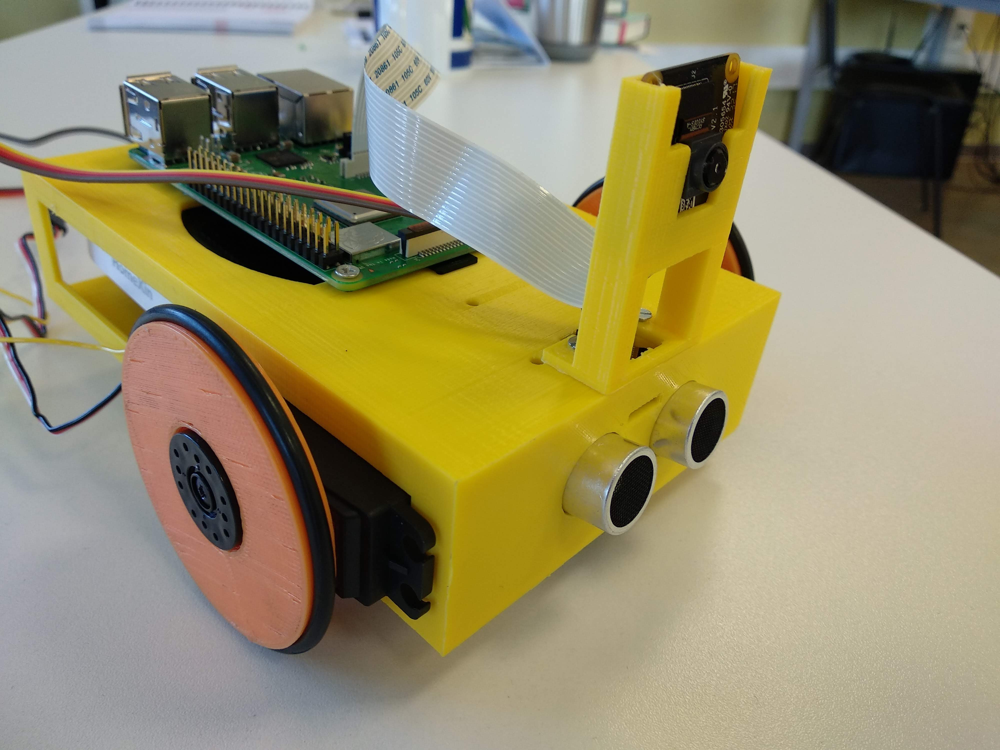

PiBot es un robot educativo creado por el equipo de JdeRobot. Consta de una Raspberry PI, una PiCam, varios sensores y actuadores comunes (y baratos), una bateria y un conjunto de piezas imprimibles.

Es Hardware abierto.

Los drivers son de código abierto, por lo que los estudiantes pueden programar aplicaciones del PiBot con python. Además, Pueden programar para el PiBot simulado en gazebo. El modelo y los plugins tambien usan el mismo interfaz de programacion que el PiBot real.

| Lado izquierdo del PiBot       | Lado derecho del PiBot          |
| ------------------------------ | ------------------------------- |
|  |  |


[PiBot-sim]: http://jderobot.github.io/JdeRobot/pibot-2.png "Simulated PiBot"
[PiBot-real]: http://jderobot.github.io/JdeRobot/pibot-1.png "Real PiBot"


# Interfaz de Programación

La capa de abstracción de hardware

La capa de abstracción de hardware (HAL, Hardware Abstraction Layer) está compuesta por 4 tipos: sensores puros, actuadores puros, sensores personalizados y actuadores personalizados.

| Función | Significado |
| ------ |------|
| avanzar | Avanza con la velocidad dada|
| retroceder | Retrocede con la velocidad dada|
| parar | El robot se detiene|
| girarIzquierda | Gira con la velocidad dada |
| girarDerecha | Gira con la velocidad dada |
| leerUltrasonido | Devuelve la distacia leida por el ultrasonido |
| leerIRSigueLineas | Devuelve el valor de los siguelineas (0: ambos sensores sobre la linea, 1: solo sensor izquierdo sobre la linea, 2: solo sensor derecho sobre la linea, 3: ambos sensores fuera de la linea) |
| leerIntensidadSonido | Get US measurement |
| leerPotenciometro | devuelve el valor del potenciometro |
| moverServo | mueve el servo a la posición indicada |
| dameImagen | Devuelve la imagen de la camara del robot |
| damePosicionDeObjetoDeColor | Devuelve la posición del objeto del color indicado en la imagen dada |


# Lista de componentes

| # |  Componentes          | Modelo                                                   | Precio aproximado           | Proveedores                                               |
|---|-----------------|----------------------------------------------------------|-----------------------|-------------------------------------------------------|
| 1 | Raspberri Pi    | 3 Modelo B                                               | 36.19 €               | [Proveedor1](http://amzn.eu/7uRiBW7)              |
| 2 | Tarjeta SD      | Toshiba M203 - 16GB                                      | 8.98 €                | [Proveedor1](http://amzn.eu/bW0ki3k)                     |
| 3 | Cámara PiCam           | PI NOIR V2.1                                             | 29.81 €               | [Proveedor1](http://amzn.eu/eGM1Ubi)                     |
| 4 | Batería  | HomeXin 10000mAh                                         | 15.99 ~ 19.99 €       | [Proveedor1](http://amzn.eu/dQH6yoq)                     |
| 5 | Motores         | Parallax Feedback 360° High Speed Servo                  | 20.50 € x 2 = 41 € | [Proveedor1](https://www.parallax.com/product/900-00360) [Proveedor2](https://www.mouser.es/ProductDetail/Parallax/900-00360?qs=sGAEpiMZZMtt6tuQNKDHLE0oGB4bKBGVOpFaHt1npXQ%3d)    |
| 6 | Sensor ultrasonidos    | hc-SR04                                                  | 1.09 €                | [Proveedor1](http://amzn.eu/b4SQsB3)                     |
| 7 | Sensores infrarrojos     | AZDelivery FOLGER Line Tracking Sensor Módulo TCRT5000   | 8.29 €                | [Enlace1](http://amzn.eu/55ZCxem)                     |
| 8 | Rueda Loca      | Bola de Metal para rodamiento - 15mm - 5pcs              | 7.99 €                | [Proveedor1](http://amzn.eu/eefjAvr)                     |
| 9 | Cables GPIO     | Kuman 120pcs Cables de Puente combinados (M-M, M-H, H-H) | 5.10 €                | [Proveedor1](http://amzn.eu/5Ubyt91) 
| 10 | Dongle Wifi     | TP-LINK TL-WN823N - Mini adaptador inalámbrico USB | 10.99 €                | [Proveedor1](http://amzn.eu/b7FWw1E) |
| 11 | Junta tórica     | 5 piezas 50 mm Diámetro exterior arandelas de goma | 5.64 €                | [Proveedor1](http://amzn.eu/9MyEAnY ) |
|   | **TOTAL**       |                                                          | **175.64 €**          |                                                       |


# PiBot en acción

<a href="http://www.youtube.com/watch?feature=player_embedded&v=jZ3wTeToTUo" target="_blank"></a>

  ```

  ```